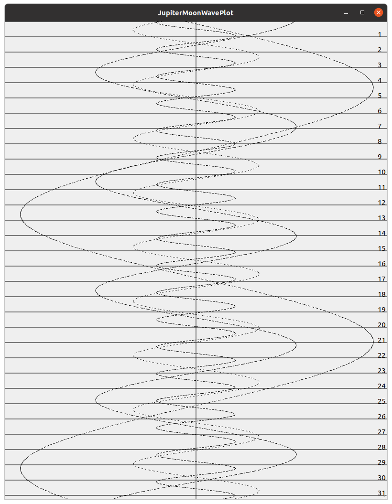

## JupiterMoonWavePlot

### Graphical show Jupiter moons position

Plots the position of the Galilean moons. This is a very early version with many todo's ( e.g. export to pdf etc.)



**Dependencies :**
- Qt 4.8.0 and above 
- AA+ v2.33 and above (http://www.naughter.com/aa.html)

AA+ implements the algorithms from the book "Astronomical algortihms" by Jean Meeus. (http://www.willbell.com/math/mc1.htm)
You may find comments in the code refering to this book.

**Build:**

I need to update CMakeLists.txt to make this work from the command line ( the instructions below won't work yet as it won't find Qt)
For now easiest is to open the CMakeLists.txt file in QtCreator and build the project.

```
./getaaplus.bash
mkdir build
cd build/
cmake ../ -DQT_QMAKE_EXECUTABLE=<path to Qt> -DCMAKE_INSTALL_PREFIX=<path to install dir>
make -j4
```

**Supported platforms:**
- Every platform that Qt supports
